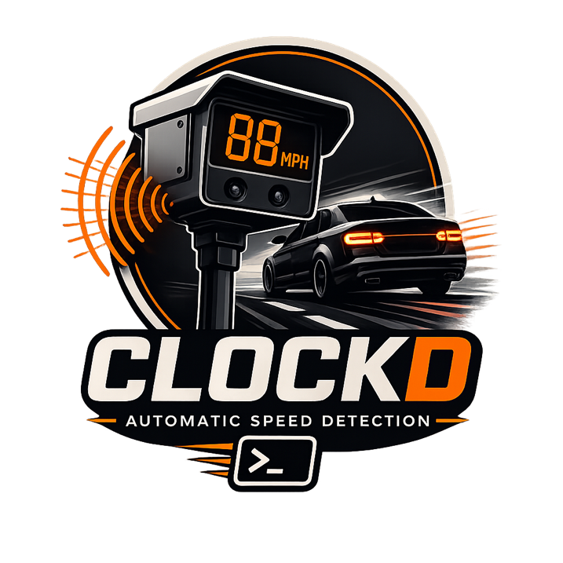

# Clockd

[](https://github.com/nathan-v/Clockd/blob/main/LICENSE)
[](https://www.python.org/downloads/)
[](https://github.com/nathan-v/Clockd/actions/workflows/ci.yml)
[](https://github.com/nathan-v/Clockd/releases)
[](https://github.com/nathan-v/Clockd/commits/main)



Clockd is a simple API service that estimates vehicle speeds from security camera video clips.

It uses YOLO object detection, ByteTrack tracking, and perspective correction to produce per-vehicle speed estimates in JSON.

## Quick Start

```bash
pip install -e .
uvicorn clockd.main:app
# http://localhost:8000/health
```

Or with Docker:

```bash
docker compose up clockd-cpu
```

## API

| Method | Path | Description |
|--------|------|-------------|
| `GET` | `/health` | Health check |
| `GET` | `/cameras` | List configured cameras |
| `GET` | `/cameras/{id}` | Get camera config |
| `POST` | `/cameras` | Create camera config |
| `PUT` | `/cameras/{id}` | Update camera config |
| `DELETE` | `/cameras/{id}` | Delete camera config |
| `POST` | `/process` | Process video (multipart upload) |
| `GET` | `/jobs` | List async jobs |
| `GET` | `/jobs/{id}` | Get job status/results |
| `DELETE` | `/jobs/{id}` | Delete completed/failed job |
| `POST` | `/calibrate/preview` | Overlay ROI + detections on a frame |
| `POST` | `/calibrate/warp` | Bird's-eye perspective transform view |
| `POST` | `/calibrate/extract-frame` | Extract a single frame from a video |
| `POST` | `/calibrate/speed-test` | Auto-calibrate with a known-speed video |
| `GET` | `/calibrate/ui` | Interactive point-and-click calibration UI |

### Processing a Video

```bash
curl -F file=@clip.mp4 -F camera_id=front_yard http://localhost:8000/process
```

For async processing:

```bash
curl -F file=@clip.mp4 -F camera_id=front_yard -F async_mode=true http://localhost:8000/process
# Returns {"job_id": "...", "status": "pending"}
# Poll: curl http://localhost:8000/jobs/<job_id>
```

## Camera Configuration

Each camera needs a calibration profile that maps pixel coordinates to real-world measurements. Configs live in `configs/cameras/*.yaml` and can also be managed via the API.

```yaml
camera_id: "front_yard"
description: "Front yard camera, ~90 degrees to road"
resolution: [1920, 1080]    # Expected video resolution [width, height]

calibration:
  source_points:            # 4 pixel corners of the road region in the video
    - [100, 400]
    - [700, 400]
    - [900, 700]
    - [50, 700]
  target_width_m: 8.0       # Real-world width of that region in meters
  target_height_m: 40.0     # Real-world height of that region in meters

roi_polygon: null            # Optional detection zone (defaults to source_points)
model_override: null         # Optional YOLO model override (e.g. "yolov8m.pt")
confidence_override: null    # Optional confidence threshold override
min_detections: 10           # Minimum detections to report a valid speed
smoothing_window: 5          # Moving average window for position smoothing
speed_calibration_factor: 1.0  # Multiply all speeds by this value
speed_range:                 # Discard speeds outside this range
  min_mph: 3.0
  max_mph: 150.0
```

### Calibration Tuning Tool

Use the calibration endpoints to visually verify your camera config before processing videos.

**Preview** - shows your ROI polygon, labeled source points, and detected vehicles on a camera frame:

```bash
# With vehicle detection (default)
curl -F file=@frame.jpg -F camera_id=front_yard http://localhost:8000/calibrate/preview -o preview.png

# Without detection (just ROI overlay)
curl -F file=@frame.jpg -F camera_id=front_yard -F detect=false http://localhost:8000/calibrate/preview -o preview.png
```

- Green polygon = ROI / detection zone
- Red dots = source point corners (labeled TL, TR, BR, BL)
- Green boxes = vehicles inside the ROI
- Gray boxes = vehicles outside the ROI (won't be tracked)

**Warp** - shows the bird's-eye perspective-transformed view with a 1-meter grid overlay:

```bash
curl -F file=@frame.jpg -F camera_id=front_yard http://localhost:8000/calibrate/warp -o warp.png
```

The warp view should show a rectangular top-down view of the road. If it looks distorted or the grid spacing seems wrong, adjust your `source_points` or real-world dimensions.

**Extract a frame** from a video (so you don't need ffmpeg):

```bash
curl -F file=@clip.mp4 http://localhost:8000/calibrate/extract-frame -o frame.png

# Or grab a specific frame (e.g. frame 100)
curl -F file=@clip.mp4 -F frame_number=100 http://localhost:8000/calibrate/extract-frame -o frame.png
```

**Interactive UI** - open [http://localhost:8000/calibrate/ui](http://localhost:8000/calibrate/ui) in a browser to click 4 points on your camera frame and generate the config visually. The UI lets you drag-and-drop an image, click the road corners, set dimensions, and either copy the YAML or create the camera directly via the API.

### Generate a Camera Config with AI

Setting up `source_points` and real-world measurements can be tricky. You can use an LLM like Claude to generate the config for you. This may not work as well as using the config UI but YMMV.

**What to provide:**

1. A screenshot/frame from your camera (so the LLM can identify the road and estimate pixel coordinates)
2. A Google Maps satellite link centered on the camera location (so the LLM can measure real-world road width and calibration zone length)
3. Basic details: camera ID, resolution, and mounting info

**Prompt:**

> I need to create a camera calibration config for Clockd, a vehicle speed estimation system. The config maps a trapezoidal road region in the camera frame to real-world meter dimensions using a perspective transform.
>
> Here is a frame from my security camera:
> [attach screenshot]
>
> Here is a Google Maps satellite view of the road the camera is pointed at:
> [paste Google Maps link]
>
> Camera details:
> - Camera ID: [e.g. "front_yard"]
> - Resolution: [e.g. 1920x1080]
> - Description: [e.g. "Front yard camera, mounted 10ft high, ~90 degrees to road"]
>
> Please generate a YAML camera config with these fields:
>
> ```yaml
> camera_id: "<id>"
> description: "<description>"
> resolution: [<width>, <height>]   # video resolution in pixels
>
> calibration:
>   source_points:        # 4 pixel coordinates [x, y] forming a trapezoid around the road
>     - [x1, y1]          # top-left of road region
>     - [x2, y2]          # top-right
>     - [x3, y3]          # bottom-right
>     - [x4, y4]          # bottom-left
>   target_width_m: <w>   # real-world width of the road region in meters
>   target_height_m: <h>  # real-world depth/length of the road region in meters
>
> roi_polygon: null
> model_override: null
> confidence_override: null
> min_detections: 10       # minimum frames a vehicle must be tracked
> smoothing_window: 5      # moving average for position noise reduction
> speed_range:
>   min_mph: 3.0           # ignore below (parked/creeping vehicles)
>   max_mph: 150.0         # ignore above (tracking glitches)
> ```
>
> For `source_points`: identify the road surface in the camera frame and pick 4 corners that form a trapezoid covering the section of road where vehicles travel. The top edge should be further away, the bottom edge closer to the camera. Points must be at the camera's native resolution.
>
> For `target_width_m` and `target_height_m`: use the Google Maps satellite view to measure the real-world width of the road and the depth (along the direction of travel) of the region covered by the source points. These values directly determine speed accuracy.
>
> For `speed_range`: set `max_mph` based on the road type (residential ~45, highway ~85). Set `min_mph` to 3-5 to filter out parked cars that jitter.

**Why Google Maps helps:** The camera image gives pixel coordinates but no sense of scale. The satellite view lets the LLM measure actual road width (typically 3-4m per lane) and estimate the length of the calibration zone, which directly determines speed accuracy.

## Accuracy Tips

Speed accuracy depends primarily on calibration quality and camera setup. Here's what matters most:

**Camera placement (biggest impact):**
- Mount the camera **perpendicular to the road** (60-90 degrees). Cameras looking along the road (shallow angle) compress the depth axis and amplify errors.
- Higher mounting = better. 8-15 feet gives a good overhead perspective. Ground-level cameras have extreme perspective distortion.
- Minimize the distance to the road. Farther away = smaller vehicles in frame = less precise bounding boxes.

**Video settings:**
- **Higher FPS is better.** 30fps gives ~2x more position samples than 15fps. More samples = smoother speed curves and more reliable min/max estimates.
- **Resolution matters for detection, not speed math.** 1080p is ideal. 4K works but is slower to process with no accuracy gain. 720p is acceptable if vehicles are close.
- **Set `resolution` in your camera config.** If the video resolution doesn't match the calibration, source point coordinates will be wrong and all speeds will be silently inaccurate.

**Calibration:**
- **`target_width_m` and `target_height_m` directly scale all speed values.** If your road width is off by 20%, all speeds are off by 20%. Measure carefully - use Google Maps satellite view.
- **Larger calibration zones are more accurate.** A 40m depth zone gives a vehicle more frames to track than a 10m zone, reducing noise.
- Use the **calibration preview** (`/calibrate/preview`) to verify your ROI covers the road correctly, and the **warp view** (`/calibrate/warp`) to verify the perspective transform produces a clean bird's-eye view.

**Speed calibration:**

If reported speeds are consistently off, use `speed_calibration_factor` to correct them without re-doing your calibration:

1. Drive past the camera at a known GPS-verified speed (e.g. 25 mph)
2. Process the clip and note the reported speed (e.g. 32 mph)
3. Set `speed_calibration_factor` to `actual / reported` (25 / 32 = 0.78)
4. Update the camera config via `PUT /cameras/{id}`

All speeds for that camera will be multiplied by this factor. Do 2-3 passes at different speeds to confirm the error is consistent before setting it. Default is `1.0` (no adjustment).

**Filtering settings:**
- `min_detections: 10` - a vehicle tracked for only 2-3 frames produces unreliable speed. 10+ detections gives stable estimates.
- `smoothing_window: 5` - reduces bounding box jitter between frames. Higher values = smoother but may round off genuine speed changes. 3-7 is the sweet spot.
- `speed_range` - set `max_mph` to something reasonable for your road (residential: 45, collector: 55, highway: 85). This filters out tracking glitches that show 200+ mph.

## Grafana Dashboard

A pre-built Grafana dashboard is included at [`grafana/clockd-dashboard.json`](grafana/clockd-dashboard.json). Import it via **Dashboards > Import > Upload JSON**. It requires an InfluxDB v2 datasource configured with the **Flux** query language.

Panels: vehicle speed (max/avg/min), vehicles detected, processing time, speed distribution histogram, detection confidence, HTTP requests, and request duration.

## Configuration

Server settings in `configs/server.yaml` or via `CLOCKD_` environment variables:

| Setting | Default | Description |
|---------|---------|-------------|
| `host` | `0.0.0.0` | Bind address |
| `port` | `8000` | Bind port |
| `detection_backend` | `local` | `"local"`, `"roboflow"`, `"localai"`, or `"codeproject_ai"` |
| `model` | `yolo26n.pt` | Default YOLO model (local backend only) |
| `confidence` | `0.3` | Detection confidence threshold |
| `default_unit` | `mph` | Speed unit (`mph` or `kmh`) |
| `max_upload_mb` | `200` | Max upload size |
| `max_workers` | `2` | Async job thread pool size |
| `cameras_dir` | `configs/cameras` | Camera configs directory |
| `max_cameras` | `50` | Max camera configs the API will create via `POST /cameras` |

Environment variables take precedence over `server.yaml`. Nested settings use `__` as the delimiter, which lets you keep secrets (NVR passwords, InfluxDB tokens) out of the config file entirely and inject them at deploy time — e.g. from a Kubernetes Secret:

```
CLOCKD_METRICS__INFLUXDB_V2__TOKEN=...
CLOCKD_EVENT_SOURCES__HOME_NVR__UNIFI__USERNAME=clockd-user
CLOCKD_EVENT_SOURCES__HOME_NVR__UNIFI__PASSWORD=...
```

A complete hardened Kubernetes deployment (secrets via env vars, non-root, read-only root filesystem, dropped capabilities) is provided at [`deploy/k8s-example.yaml`](deploy/k8s-example.yaml).

### Detection Backends

**Local (default)** - runs YOLO locally via ultralytics. Supports CPU and GPU. No external dependencies beyond the Python packages.

#### YOLO Model Selection

Models auto-download on first use. Pick based on your hardware:

| Model | Speed | Accuracy | Best for |
|-------|-------|----------|----------|
| `yolo26n.pt` (default) | Fastest | Good | CPU, Raspberry Pi |
| `yolo26s.pt` | Fast | Better | Moderate CPU or any GPU |
| `yolo26m.pt` | Medium | Great | GPU with 4GB+ VRAM |
| `yolo26l.pt` | Slow | Excellent | GPU with 8GB+ VRAM |
| `yolo26x.pt` | Slowest | Best | Beefy GPU, max accuracy |

YOLOv8, v9, v10, v11, and v12 variants are also supported. For security camera footage where vehicles are typically large in frame, nano or small is usually sufficient - calibration accuracy has more impact on speed estimates than model size.

Set globally in `server.yaml` via `model`, or per-camera via `model_override`.

#### Remote Detection Backends

All remote backends offload detection to an external server. Clockd sends each frame and receives bounding boxes back. Tracking, perspective transform, and speed calculation still run locally. The `model` and `model_override` settings are ignored - the model is configured on the remote server.

##### Backend Comparison

| Backend | Models | GPU | Coral TPU | OS | Status | Best for |
|---------|--------|-----|-----------|-----|--------|----------|
| **Local** (default) | YOLO v8/v9/v10/v11/v12/26 | CUDA | No | Any | Ultralytics (very active) | Simplest setup, no extra services |
| **[Roboflow Inference](https://github.com/roboflow/inference)** | YOLO v8/v10/v11/26, RF-DETR, YOLO-NAS | CUDA + TensorRT | No | Linux, macOS | Very active (daily commits) | GPU server, best model selection |
| **[LocalAI](https://github.com/mudler/localai)** | RF-DETR | CUDA, ROCm, Vulkan | No | Linux, macOS, Windows | Very active (monthly releases) | Already running LocalAI for LLMs |
| **[CodeProject.AI](https://github.com/codeproject/CodeProject.AI-Server)** | YOLOv5, v8, v11 | CUDA | Yes (YOLOv5 TFLite) | Windows, Linux, macOS | Slow (last release Dec 2024) | Raspberry Pi + Coral TPU |

**Notes:**
- **Roboflow Inference** is the recommended remote backend. Broadest model support, actively maintained, no API key needed for pre-trained COCO models, and supports TensorRT quantization for maximum GPU throughput. Runs on Linux and macOS only (Docker-based). For GPU use, Linux with the NVIDIA Container Toolkit is recommended.
- **LocalAI** only supports RF-DETR for object detection (not YOLO). It's a good choice if you already run LocalAI for other AI tasks. Supports the widest range of GPU vendors (NVIDIA, AMD, Intel).
- **CodeProject.AI** is the only backend with Coral TPU support, via its YOLOv5 TFLite module. This makes it a viable option for low-power deployments like a Raspberry Pi with a Coral accelerator. The project has slowed (volunteer-maintained, 18+ months since last release) but remains functional.
- For most users, **local + `yolo26n.pt` on CPU** is fast enough. Remote backends are worth it for larger models on GPU, high-volume processing, or shared inference across multiple services.

##### Backend Configuration

**Roboflow Inference:**

```yaml
detection_backend: "roboflow"

roboflow:
  url: "http://your-gpu-server:9001"
  model_id: "yolo11n-640"   # any alias from inference docs
  timeout: 30
```

Start the server: `pip install inference-cli && inference server start`

**LocalAI:**

```yaml
detection_backend: "localai"

localai:
  url: "http://localhost:8080"
  model: "rfdetr-base"
  timeout: 30
```

**CodeProject.AI:**

```yaml
detection_backend: "codeproject_ai"

codeproject_ai:
  url: "http://localhost:32168"
  timeout: 30
```

## Event Sources (NVR Integration)

Clockd can automatically poll your NVR for vehicle detection events, download clips, and process them — no external automation needed.

### UniFi Protect

Add to `configs/server.yaml`:

```yaml
event_sources:
  home_nvr:
    enabled: true
    camera_map:
      "aabbccddeeff00112233aabb": "front_yard"  # Protect camera ID -> clockd camera_id
    unit: "mph"
    unifi:
      host: "192.168.1.1"
      username: "clockd-user"
      password: "your-password"
      verify_ssl: false       # Protect uses self-signed certs
      poll_interval_s: 30     # seconds between polls
      event_end_timeout_s: 300  # max wait for event to end
```

Find your Protect camera ID in the Protect web UI URL: `https://protect.local/cameras/<camera_id>`.

The `camera_map` maps Protect camera IDs to clockd camera config names. Only mapped cameras are monitored. Multiple event sources can be configured for different NVR instances.

The poller authenticates to Protect, watches for vehicle smart-detection events, waits for each event to end, downloads the clip, and submits it through the standard processing pipeline. Results are available via the jobs API and flow through any configured metrics exporters.

### Adding Other NVR Sources

The event source system is modular. To add support for Frigate, ZoneMinder, or another NVR:

1. Create `src/clockd/services/event_sources/your_nvr.py` implementing the `EventSource` base class (`start`, `stop`, `name`)
2. Add a config model to `config.py`
3. Add a branch in the `create_event_source()` factory in `manager.py`

No changes needed to the processing pipeline, job manager, or metrics.

## Security Notice

Clockd does **not** include authentication, authorization, or rate limiting. It is designed to run on a trusted local network. If you need to expose it beyond your LAN, place it behind a reverse proxy (e.g. Nginx, Caddy, Traefik) that handles TLS, authentication, and rate limiting. The default Docker Compose config binds to `127.0.0.1` for this reason.

See [SECURITY.md](SECURITY.md) for vulnerability reporting and known limitations.

## Development

```bash
pip install -e ".[dev]"
pytest
```
